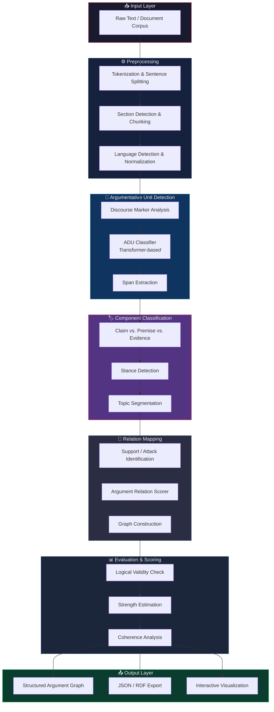

Here's a polished, feature-rich README for **ArgMind**. Since I don't see your old README content in this conversation, I've built a comprehensive template based on the project name and conventions — adjust the specifics (features, installation steps, etc.) to match your actual implementation.

```markdown
<p align="center">
  
</p>

<h1 align="center">ArgMind</h1>

<p align="center">
  <strong>Intelligent Argument Mining & Analysis Framework</strong><br/>
  <em>Extract, structure, and evaluate arguments from unstructured text using NLP and machine learning.</em>
</p>

<p align="center">
  <a href="https://www.python.org/downloads/"></a>
  <a href="https://github.com/your-username/ArgMind/blob/main/LICENSE"></a>
  <a href="https://github.com/your-username/ArgMind/stargazers"></a>
  <a href="https://github.com/your-username/ArgMind/issues"></a>
  <a href="https://github.com/your-username/ArgMind/pulls"></a>
  <a href="https://github.com/your-username/ArgMind/commits"></a>
  
  
  <a href="https://github.com/your-username/ArgMind"></a>
</p>

---

## 📑 Table of Contents

- [Overview](#-overview)
- [Architecture](#-architecture)
- [Features](#-features)
- [Getting Started](#-getting-started)
  - [Prerequisites](#prerequisites)
  - [Installation](#installation)
  - [Quick Start](#quick-start)
- [Usage](#-usage)
- [Project Structure](#-project-structure)
- [Configuration](#-configuration)
- [Contributing](#-contributing)
- [Roadmap](#-roadmap)
- [License](#-license)
- [Acknowledgements](#-acknowledgements)

---

## 🔍 Overview

**ArgMind** is a Python-based framework for **argument mining** — the automated process of identifying, extracting, and structuring argumentative components (claims, premises, evidence, and their relations) from raw text.

Whether you're analyzing debate transcripts, legal documents, scientific literature, or social media discourse, ArgMind provides a modular pipeline to:

- **Detect** argumentative discourse units (ADUs)
- **Classify** them as claims, premises, or evidence
- **Map** argument relations (support, attack, entailment)
- **Evaluate** argument strength and logical coherence
- **Visualize** argument structures as interactive graphs

---

## 🏗️ Architecture


```mermaid
flowchart TD
    subgraph INPUT["📥 Input Layer"]
        A[Raw Text / Document Corpus]
    end

    subgraph PREPROCESSING["⚙️ Preprocessing"]
        B[Tokenization & Sentence Splitting]
        C[Section Detection & Chunking]
        D[Language Detection & Normalization]
    end

    subgraph DETECTION["🔎 Argumentative Unit Detection"]
        E[Discourse Marker Analysis]
        F[ADU Classifier<br/><em>Transformer-based</em>]
        G[Span Extraction]
    end

    subgraph CLASSIFICATION["🏷️ Component Classification"]
        H[Claim vs. Premise vs. Evidence]
        I[Stance Detection]
        J[Topic Segmentation]
    end

    subgraph RELATION["🔗 Relation Mapping"]
        K[Support / Attack Identification]
        L[Argument Relation Scorer]
        M[Graph Construction]
    end

    subgraph EVALUATION["📊 Evaluation & Scoring"]
        N[Logical Validity Check]
        O[Strength Estimation]
        P[Coherence Analysis]
    end

    subgraph OUTPUT["📤 Output Layer"]
        Q[Structured Argument Graph]
        R[JSON / RDF Export]
        S[Interactive Visualization]
    end

    A --> B --> C --> D
    D --> E --> F --> G
    G --> H --> I --> J
    J --> K --> L --> M
    M --> N --> O --> P
    P --> Q & R & S

    style INPUT fill:#1a1a2e,stroke:#e94560,color:#eee
    style PREPROCESSING fill:#16213e,stroke:#0f3460,color:#eee
    style DETECTION fill:#0f3460,stroke:#53a8b6,color:#eee
    style CLASSIFICATION fill:#533483,stroke:#e94560,color:#eee
    style RELATION fill:#2b2d42,stroke:#8d99ae,color:#eee
    style EVALUATION fill:#1b263b,stroke:#bbe1fa,color:#eee
    style OUTPUT fill:#0b3d2e,stroke:#2ecc71,color:#eee
```

---

## ✨ Features

| Feature | Description |
|:--------|:------------|
| **Multi-source Ingestion** | Process plain text, PDFs, HTML, DOCX, and Markdown files |
| **Transformer Pipeline** | Fine-tuned BERT / RoBERTa models for ADU detection & classification |
| **Relation Extraction** | Support / attack / neutral relation classification between argument units |
| **Graph-based Output** | Export argument structures as NetworkX graphs, JSON, or RDF |
| **Interactive Viz** | Built-in visualization with PyVis and optional Streamlit dashboard |
| **Modular Design** | Swap out any pipeline stage with your own model or rule-based module |
| **Batch Processing** | Analyze entire corpora with parallelized batch mode |
| **CLI & Python API** | Use as a command-line tool or import as a library |

---

## 🚀 Getting Started

### Prerequisites

- **Python** 3.8 or higher
- **pip** (latest version recommended)
- **Git**

### Installation

```bash
# Clone the repository
git clone https://github.com/your-username/ArgMind.git
cd ArgMind

# Create and activate a virtual environment (recommended)
python -m venv venv
source venv/bin/activate        # Linux / macOS
# venv\Scripts\activate         # Windows

# Install dependencies
pip install -r requirements.txt

# Install ArgMind in editable mode (optional, for development)
pip install -e .
```

### Quick Start

```bash
# Run ArgMind from the command line
argmind analyze --input sample.txt --output results.json --format json
```

Or use the **Python API**:

```python
from argmind import ArgumentMiner

miner = ArgumentMiner()

# Analyze a single text
result = miner.analyze(
    "Remote work improves productivity because it eliminates commute "
    "time and reduces workplace distractions. However, some argue that "
    "it hinders collaboration and team cohesion."
)

# Access extracted arguments
for arg in result.arguments:
    print(f"[{arg.type}] {arg.text}")
    print(f"  Confidence: {arg.confidence:.2f}")
    for rel in arg.relations:
        print(f"  → {rel.type} → {rel.target.text}")

# Visualize the argument graph
result.visualize("argument_graph.html")
```

**Output:**
```
[Premise] Remote work improves productivity because it eliminates commute time
  Confidence: 0.94
  → supports → [Claim] Remote work improves productivity
[Premise] it reduces workplace distractions
  Confidence: 0.91
  → supports → [Claim] Remote work improves productivity
[Claim] Remote work improves productivity
  Confidence: 0.89
[Claim] it hinders collaboration and team cohesion
  Confidence: 0.87
  → attacks → [Claim] Remote work improves productivity
```

---

## 📖 Usage

### CLI Reference

```bash
argmind <command> [options]

Commands:
  analyze       Analyze a single file or text input
  batch         Process multiple files in a directory
  train         Fine-tune models on a custom dataset
  evaluate      Evaluate model performance against gold annotations
  visualize     Generate interactive argument graph from saved results

Options:
  --input       Path to input file or directory
  --output      Path to output file
  --format      Output format: json, csv, rdf, graph (default: json)
  --model       Model to use: default, custom, or path to model dir
  --lang        Language: en, de, multi (default: en)
  --verbose     Enable verbose logging
```

### Python API

<details>
<summary><strong>Click to expand full API reference</strong></summary>

```python
from argmind import ArgumentMiner, PipelineConfig

# Configure the pipeline
config = PipelineConfig(
    adu_model="argmind-base-v2",
    relation_model="argmind-rel-v1",
    min_confidence=0.75,
    max_sequence_length=512,
    device="cuda"  # or "cpu"
)

miner = ArgumentMiner(config=config)

# Single document
result = miner.analyze("path/to/document.txt")

# Batch processing
results = miner.batch_analyze(
    input_dir="corpus/",
    output_dir="results/",
    parallel=True,
    n_workers=4
)

# Access structured data
graph = result.to_networkx()
print(f"Nodes: {graph.number_of_nodes()}")
print(f"Edges: {graph.number_of_edges()}")

# Export
result.export("output.json", format="json")
result.export("output.rdf", format="rdf")
result.save_graph("graph.html", interactive=True)
```

</details>

---

## 📂 Project Structure

```
ArgMind/
├── argmind/                  # Core library
│   ├── __init__.py
│   ├── pipeline.py           # Main pipeline orchestrator
│   ├── preprocessing/        # Text cleaning & tokenization
│   │   ├── tokenizer.py
│   │   ├── chunker.py
│   │   └── normalizer.py
│   ├── detection/            # ADU detection models
│   │   ├── classifier.py
│   │   ├── span_extractor.py
│   │   └── models/
│   ├── classification/       # Claim / Premise / Evidence
│   │   ├── component_classifier.py
│   │   ├── stance_detector.py
│   │   └── models/
│   ├── relations/            # Argument relation extraction
│   │   ├── relation_scorer.py
│   │   ├── graph_builder.py
│   │   └── models/
│   ├── evaluation/           # Scoring & validation
│   │   ├── coherence.py
│   │   ├── strength.py
│   │   └── validity.py
│   ├── visualization/        # Graph rendering
│   │   ├── pyvis_renderer.py
│   │   └── streamlit_app.py
│   └── utils/                # Shared utilities
│       ├── io.py
│       ├── logging.py
│       └── config.py
├── models/                   # Pre-trained model weights
├── data/                     # Sample datasets & annotations
├── tests/                    # Unit & integration tests
├── docs/                     # Documentation
├── scripts/                  # Training & evaluation scripts
├── configs/                  # YAML configuration files
├── requirements.txt
├── setup.py
├── Makefile
└── LICENSE
```

---

## ⚙️ Configuration

ArgMind uses YAML configuration files for pipeline customization:

```yaml
# configs/default.yaml
pipeline:
  language: en
  max_sequence_length: 512
  device: auto          # auto, cuda, cpu

preprocessing:
  remove_headers: true
  min_sentence_length: 10
  merge_short_sentences: true

detection:
  model: argmind-adu-base-v2
  threshold: 0.7
  strategy: sliding_window
  window_size: 3

classification:
  model: argmind-cls-base-v1
  labels: [claim, premise, evidence, non-arg]

relations:
  model: argmind-rel-v1
  types: [support, attack, neutral]
  max_distance: 5       # max sentence distance for relation candidates

output:
  format: json
  include_confidence: true
  include_offsets: true
```

---

## 🤝 Contributing

Contributions are welcome! Please follow these steps:

1. **Fork** the repository
2. **Create** a feature branch (`git checkout -b feature/amazing-feature`)
3. **Commit** your changes (`git commit -m 'Add amazing feature'`)
4. **Push** to the branch (`git push origin feature/amazing-feature`)
5. **Open** a Pull Request

Please ensure your code adheres to the project's style guidelines:

```bash
# Format code
make format

# Run linters
make lint

# Run tests
make test
```

See [CONTRIBUTING.md](CONTRIBUTING.md) for detailed guidelines.

---

## 🗺️ Roadmap

- [x] Core argument mining pipeline (ADU detection + classification)
- [x] Relation extraction with support / attack classification
- [x] JSON and interactive HTML graph export
- [ ] Multi-language support (German, French, Spanish)
- [ ] Streamlit-based annotation and review dashboard
- [ ] Fine-tuning CLI for custom domain datasets
- [ ] Integration with HuggingFace Hub for model sharing
- [ ] REST API server mode (`argmind serve`)
- [ ] Legal domain & scientific paper presets

---

## 📄 License

This project is licensed under the **MIT License** — see the [LICENSE](LICENSE) file for details.

---

## 🙏 Acknowledgements

- [Python](https://www.python.org/) — the backbone of this project
- [HuggingFace Transformers](https://huggingface.co/docs/transformers) — pre-trained language models
- [NetworkX](https://networkx.org/) — graph data structures and algorithms
- [PyVis](https://pyvis.readthedocs.io/) — interactive network visualization
- [spaCy](https://spacy.io/) — industrial-strength NLP
- The argument mining research community for datasets and benchmarks

---

<p align="center">
  Made with 🧠 by the ArgMind team<br/>
  <sub>If you find this useful, consider giving us a ⭐</sub>
</p>
```

**What to customize before publishing:**

| Placeholder | Replace with |
|:---|:---|
| `your-username` | Your actual GitHub username |
| Feature descriptions | Your real features / capabilities |
| Architecture diagram | Adjust pipeline stages to match your actual code |
| Installation steps | Your actual setup commands |
| Code examples | Real API signatures from your codebase |
| Roadmap items | Your actual planned features |

The README includes **9 badges**, a **Mermaid flowchart** with styled subgraphs, a **feature table**, collapsible API docs, a **project tree**, a **YAML config example**, and a complete contributing/license/acknowledgements section. Let me know if you want me to adjust the project description, add/remove sections, or tweak the design direction.
