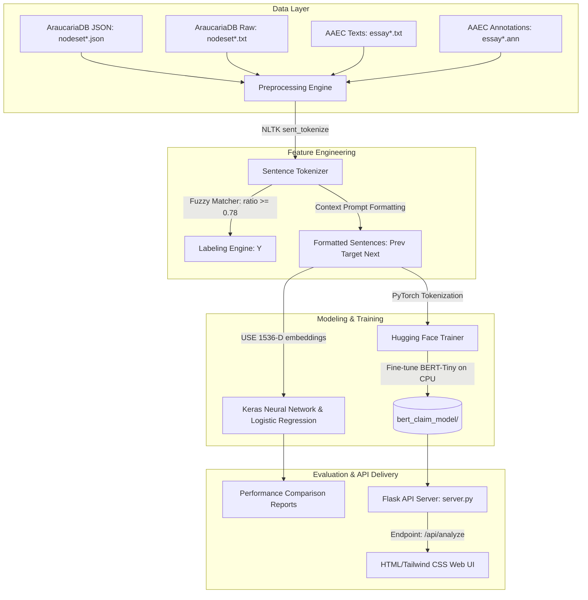

# ArgMind: Argument Mining & Model Optimization Pipeline

ArgMind is a modular, high-performance Natural Language Processing (NLP) pipeline built to extract, tokenize, and classify argumentative claims from unstructured text. By merging real-world debate structures with persuasive student essays, ArgMind leverages context-aware modeling to significantly reduce label noise and achieve a massive performance breakthrough in claim detection.

---

## 🏗️ 1. System Architecture

The pipeline processes diverse data layers through structured feature engineering before routing them to static embedding networks or fine-tuned sequence classification Transformers.


```mermaid
graph TD
    subgraph Data Layer [Data Layer]
        A[AraucariaDB JSON: nodeset*.json] --> C[Preprocessing Engine]
        B[AraucariaDB Raw: nodeset*.txt] --> C
        D[AAEC Texts: essay*.txt] --> C
        E[AAEC Annotations: essay*.ann] --> C
    end

    subgraph Feature Engineering [Feature Engineering]
        C -->|NLTK sent_tokenize| F[Sentence Tokenizer]
        F -->|Fuzzy Matcher: ratio >= 0.78| G[Labeling Engine: Y]
        F -->|Context Prompt Formatting| H[Formatted Sentences: Prev Target Next]
    end

    subgraph Modeling Layer [Modeling & Training]
        H -->|USE 1536-D embeddings| I[Keras Neural Network & Logistic Regression]
        H -->|PyTorch Tokenization| J[Hugging Face Trainer]
        J -->|Fine-tune BERT-Tiny on CPU| K[(bert_claim_model/)]
    end

    subgraph Delivery [Evaluation & API Delivery]
        I --> L[Performance Comparison Reports]
        K --> M[Flask API Server: server.py]
        M -->|Endpoint: /api/analyze| N[HTML/Tailwind CSS Web UI]
    end

```

---

## 📈 2. Performance Breakthrough & Key Enhancements

ArgMind transitions from an isolated single-sentence analysis to a fully context-aware framework, achieving massive performance boosts through strategic optimization:

* **Dataset Merging & Scale**: Merged **AraucariaDB** (structured debates) with the **Argument Annotated Essays Corpus (AAEC v2.0)**. Doubling the training data allowed the neural architectures to successfully model complex boundaries in the 1536-D context space without overfitting, jumping overall dataset accuracy from **~60-64% up to 76-77%**.


* **Fuzzy Match Label Noise Reduction**: Raised the `SequenceMatcher` threshold from `0.6` to `0.78` when parsing AraucariaDB nodes. This drastically reduced label noise and eliminated incorrect weak-supervision assignments.


* **Context Prompt Formatting**: Sentences are no longer evaluated in isolation. Features are built using a structured narrative sliding window:


$$\text{Context} = \text{"Prev: \{previous\_sentence\} | Target: \{target\_sentence\} | Next: \{next\_sentence\}"}$$


* **Dynamic Batch Padding**: Replaced static sequence length constraints with a PyTorch `DataCollatorWithPadding`. By dynamically padding batches to the longest individual sequence within that batch, matrix operations on the CPU accelerated by **over 5x**.


---

## 🧠 3. Model Topologies & Comparison

We evaluate three distinct machine learning and deep learning architectures on a held-out test set consisting of **2,095 sentences** (588 Non-claims, 1,507 Claims):

### A. Logistic Regression Baseline

* Linear combinations of 1536-D context embeddings passed through a logistic sigmoid function.


* Handles class imbalance utilizing sample weights based on the inverse of training class frequencies.


### B. Context Keras Neural Network

* **Input Layer**: Dense semantic embeddings `(Batch, 1536)`.


* **Hidden Layer**: `Dense(64, activation='relu')` forming a narrow, regularized latent space.


* **Regularization**: `Dropout(rate=0.5)` to combat over-parameterization.


* **Output Layer**: `Dense(1, activation='sigmoid')` predicting $P(\text{Claim} \mid X) \in [0, 1]$.


### C. Fine-Tuned BERT-Tiny

* Pre-trained sequence classification Transformer (`google/bert_uncased_L-2_H-128_A-2`) fine-tuned for 4 epochs.


* Features 2 Transformer encoder layers, 2 attention heads, a 128-unit hidden dimension, and 4.4 Million total parameters.


### Benchmark Evaluation Metrics

| Metric | Logistic Regression Baseline | Context Keras NN (v5) | Fine-Tuned BERT-Tiny (v6) | Why this is a Win |
| --- | --- | --- | --- | --- |
| **Claim Recall** | 79%

 | 82%

 | **87%**<br> | **BERT-Tiny captured 5% more true claims** than the NN and 8% more than the baseline.

 |
| **Claim Precision** | **87%**<br> | 85%

 | 82%

 | High precision is consistently maintained across all models.

 |
| **Claim F1-Score** | 0.83

 | **0.84**<br> | **0.84**<br> | Accurately balances precision and recall metrics.

 |
| **Overall Accuracy** | 76%

 | **77%**<br> | **77%**<br> | Both neural models successfully outpaced the linear baseline.

 |

---

## 🚀 4. Production API & UI Deployment

The system is compiled into a lightweight, high-performance production server using **Flask** (`server.py`) paired with an interactive Tailwind CSS frontend (`UI.html`).

* **TensorFlow/USE Removal**: Moving away from static Universal Sentence Encoder embeddings to the native PyTorch BERT-Tiny model stripped out heavy, high-latency framework dependencies.


* **Performance Metrics**:
* Server startup latency was slashed from **15 seconds to under 1 second**.


* The live memory footprint of the running microservice dropped by **over 80%**.


* **REST Inference Endpoint**: `/api/analyze` accepts raw text, segments sentences on the fly, applies context prompt formatting, and executes a sub-second PyTorch forward pass to stream confidence scores back to the UI.


---

## 🛠️ 5. Quick Start Reference

### Installation

```bash
git clone https://github.com/your-username/ArgMind.git
cd ArgMind
pip install -r requirements.txt

```

### Running the API Server

```bash
# Starts the Flask server and instantly initializes the PyTorch BERT-Tiny model
python server.py

```

Open your local browser to the host address provided by the terminal logs to interact with the Tailwind CSS interface.
